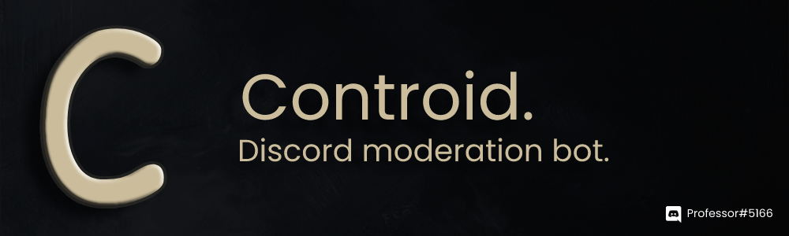

<h1>Project Controid</h1>

*Revamp your Discord server. Moderation, ticket management, member greeting, auto-moderation, music and more, all in one easy-to-use, feature-rich, and bug-free Discord bot!*

<p>
  
  <a href="https://github.com/professor-2390/controid-bot#readme" target="_blank">
    
  </a>
  <a href="https://github.com/professor-2390/controid-bot/graphs/commit-activity" target="_blank">
    
  </a>
</p>

> An **open source** `discord.js` bot which is based on official discord.js guide includes moderation, music & fun commands!

### 🏠 [Homepage](https://github.com/professor-2390/controid-bot#readme)

## Introduction

`Controid` Discord Bot is an open source discord.js based bot template. It is classic javascript, not requiring any heavy or a lot of dependencies.

`Controid` Focuses on the best user experience other than other discord bots(_sudobot, voidbot_) it makes it easy to users to use it. I have a lot future planning to implement in the bot, I only work on this bot when i get the time to so please consider staring the repository to show some support.

## 💻 Install

```sh
npm install
```

## 🔌 Configuration

- Rename [`.env.example`](https://github.com/professor-2390/controid-bot/blob/master/.env.example) to `.env` and fill the token and other values. Extend .env according to your needs!

## 👤 Author

- 👤 **Professor 2390**
  - Instagram: [@professor_2390](https://www.instagram.com/professor_2390/)
  - Github: [@professor2390](https://github.com/professor2390)

## 🤝 Contributing

Contributions, issues and feature requests are welcome!<br />Feel free to check [issues page](https://github.com/professor-2390/controid-bot/issues)

## ⭐ Show your support

Give a ⭐️ if this project helped you! Star-ring the project gives me encouragement to continue it.
Thanks a lot.

---
